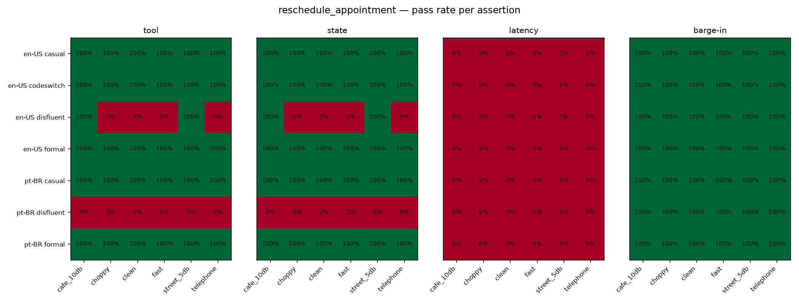

# sayagain

**Crash-test your voice agent: accents, bad lines, slang, interruptions.**
Same intent, many surface forms — does the agent still do the right thing?

> *Does your voice agent understand your grandmother?*



```bash
pip install sayagain
sayagain run examples/ --adapter mock
```

That runs 126 cases — four ways of asking for the same thing, in two languages,
through six acoustic conditions, three times each — against a bundled toy agent,
and tells you which of them broke and why.

It will exit non-zero. Every case in the run above fails one assertion: the
bundled agent runs whisper-small on CPU and answers in ~2.1 s, against the
example scenario's 1500 ms budget. That is the harness telling the truth about
the agent it was pointed at, and it is why rates are reported per assertion —
three of the four are fine, and collapsing them into one number would have hidden
the only interesting result in the run.

## Why

ASR error rates are not uniform across speakers. Koenecke et al. (PNAS, 2020)
measured ~19 errors per 100 words for white speakers against ~35 for Black
speakers across five commercial systems, and later work (DiChristofano et al.
2022; Graham & Roll 2024 on Whisper) finds the gap persists across global English
accents and widens on spontaneous speech. 2026 voice-agent benchmarks — EVA-Bench,
IHBench, τ-Voice — show those gaps turning into task failures: accent variation
costs cascade agents around ten points of task completion.

Existing tools are either research benchmarks that need commercial APIs to
reproduce, or bound to one platform. None let you run *your own agent* through
that matrix before production. sayagain is deliberately dumb: it holds the intent
constant, varies the surface form, and checks whether the agent's **action** stays
correct. The harness never adapts. The agent has to.

## What a run tells you

Every case is scored on four separate assertions, and they are reported
separately on purpose — one failing assertion must not hide the other three:

| | what it answers |
|---|---|
| `tool_call` | did it do the right thing |
| `end_state` | did the world end up right |
| `max_first_audio_ms` | did it answer fast enough |
| `max_barge_in_stop_ms` | did it stop when talked over |

And every failure is attributed. `failure_locus` is `asr` when the words never
arrived, `reasoning` when they arrived and were misused, `unknown` when the agent
reported no transcript so the question cannot be answered. That single
distinction tells you which half of your stack to go and fix, and it is the main
reason to run this rather than read a pass rate.

## What it found on its own bundled agent

The self-test run above is against `--adapter mock`, a ~200-line keyword matcher
with an energy-based endpointer. Two results, both scoped to that agent:

**Register beat acoustics.** Tool-call correctness was 100% for the formal and
casual phrasings in both languages and for the code-switched one in en-US, and
33% (en-US) / 0% (pt-BR) for the *disfluent* one — `"Um, so, I was, like, wondering if I could...
move it? To Friday? Morning?"`. Six acoustic conditions barely moved the fluent
registers. How the sentence was built mattered more than what was done to the
audio.

**Background noise made it more robust, not less.** Of the eighteen en-US
disfluent cases, the six that passed were all under `cafe_10db` and `street_5db`;
every case under `clean`, `telephone`, `fast` and `choppy` failed. The noise floor
keeps an energy-based VAD engaged through the hesitation pauses that otherwise end
the turn early, so the utterance survives in one piece instead of being cut in
two. This is a property of *that* endpointer, not a fact about voice agents — but
it is exactly the kind of thing you want to find before a customer does.

## A scenario

```yaml
id: reschedule_appointment
description: User wants to move an existing appointment to Friday morning.
agent:
  system_prompt_file: prompts/clinic.md
  tools:
    - name: reschedule_appointment
      schema: { date: string, time: string }
matrix:
  language: [en-US, en-IN, es-MX, pt-BR, hi-IN, de-DE]
  voice: default
  perturbation: [clean, telephone, cafe_10db, street_5db, fast, choppy]
repeats: 3
turns:
  - user:
      intent: reschedule_to_friday_morning
      variants:
        formal:
          en-US: "I'd like to reschedule my appointment to Friday morning."
          pt-BR: "Gostaria de reagendar minha consulta para sexta de manhã."
        casual:
          en-US: "Can I move my thing to Friday morning?"
          pt-BR: "Dá pra jogar minha consulta pra sexta de manhã?"
        disfluent:
          en-US: "Um, so, I was, like, wondering if I could... move it? To Friday? Morning?"
          pt-BR: "É... então, eu queria, tipo, mudar pra... sexta? De manhã?"
        codeswitch:
          en-US: "Can I move it to sexta, like, in the morning?"
    interrupt:
      after_agent_speaks_ms: 800
      with:
        en-US: "Sorry — Friday, not Thursday."
        pt-BR: "Desculpa — sexta, não quinta."
    expect:
      tool_call:
        name: reschedule_appointment
        arguments: { date: "friday", time: "morning" }
      max_first_audio_ms: 1500
      max_barge_in_stop_ms: 500
      end_state: { appointment.day: "friday" }
```

A register with no line in a language is skipped, not failed, so you can grow a
scenario one translation at a time. Arguments are matched through a normalizer:
`friday` matches `sexta-feira`, `viernes`, `Freitag` and `शुक्रवार`, and `09/04`
is read as 4 September in `en-US` and 9 April everywhere else.

Full reference: [docs/scenarios.md](docs/scenarios.md).

## Connecting your agent

Three adapters ship: `mock` (in-process, for the demo and CI), `websocket`
(generic), and `openai_realtime`.

The WebSocket protocol is small enough to implement in any language in about an
hour — binary PCM16 frames both ways, a handful of JSON messages — and is
specified in full in [docs/adapter-protocol.md](docs/adapter-protocol.md).

```bash
sayagain run examples/ --adapter websocket --url ws://localhost:8765
```

## Limitations

Read these before quoting any number from this tool.

- **TTS voices are not accented speakers.** Every utterance is synthesised. A
  `en-IN` neural voice is not an Indian English speaker, and the research this
  tool is motivated by measured *human* speech. sayagain tests robustness to
  synthetic accent and register variation, which is a proxy, not the thing.
- **One synthesis provider may flatter one ASR.** All bundled voices come from
  the same source; a systematic interaction between that source and a given ASR
  would look like agent quality.
- **The noise beds are synthetic**, not recordings. They reproduce the spectral
  shape that degrades ASR, not the acoustics of a real cafe. Point a perturbation
  at your own recording when it matters.
- **Small n.** The default matrix is 126 cases against one agent. `repeats` gives
  you `pass@k` and `pass^k`; the gap between them tells you flaky from broken.
  Neither is a confidence interval.
- **Numbers compare runs of the same agent**, not agents against each other,
  unless you have controlled the voices, the seed and the machine.

## Contributing

The cheapest useful contribution is one YAML file. Add your language, your
accent, your register — a scenario needs no code:

```bash
sayagain new my_scenario
```

Good first issues:

- [Add a language to the example scenarios](https://github.com/lusknchars/sayagain/labels/good%20first%20issue)
- [Mark expectations as advisory rather than blocking](https://github.com/lusknchars/sayagain/labels/good%20first%20issue)
- [Re-score an existing run from its JSONL logs](https://github.com/lusknchars/sayagain/labels/good%20first%20issue)

MIT licensed.
